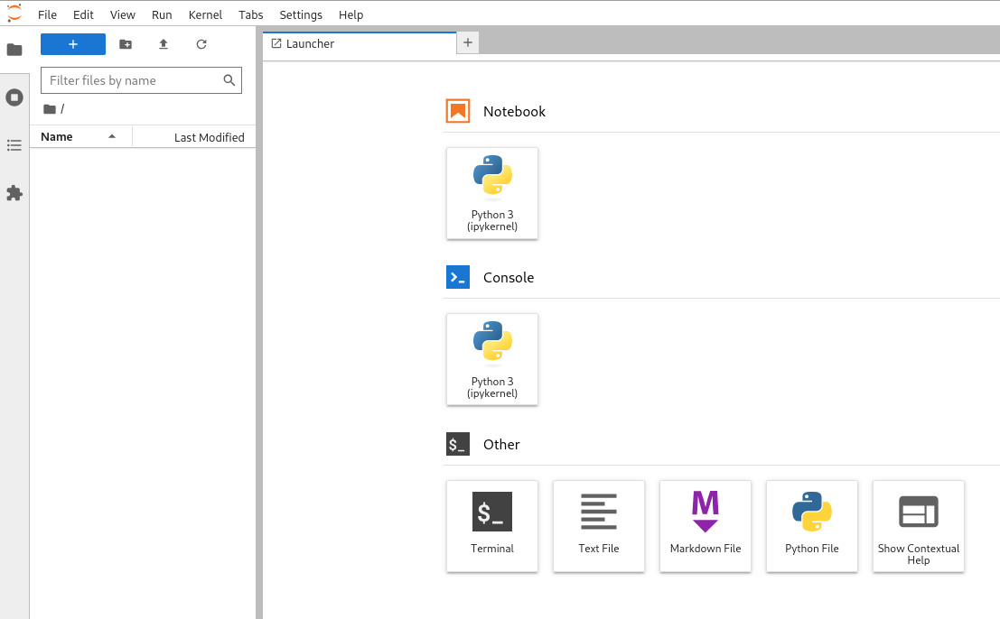

# Basic spark, jupyter Setup
The compose file defines a simple setup with [jupyter](https://jupyter.org/) and pyspark. Notebooks are enabled to interact via python with the spark-cluster.

URLs:
- 📌 Jupyter Notebook: http://localhost:8888


## Start the environment
To start the necessary services use docker compose (or podman, or ...).

```bash
# uses the file compose.yaml|.yml by default
docker compose rm # remove old containers if available
docker compose up # start the spark environment
```

The output is similar to this:

```
jupyter-spark  | Entered start.sh with args: start-notebook.py
jupyter-spark  | Running hooks in: /usr/local/bin/start-notebook.d as uid: 1000 gid: 100
jupyter-spark  | Done running hooks in: /usr/local/bin/start-notebook.d
jupyter-spark  | Running hooks in: /usr/local/bin/before-notebook.d as uid: 1000 gid: 100
jupyter-spark  | Sourcing shell script: /usr/local/bin/before-notebook.d/10activate-conda-env.sh
jupyter-spark  | Sourcing shell script: /usr/local/bin/before-notebook.d/10spark-config.sh
jupyter-spark  | Done running hooks in: /usr/local/bin/before-notebook.d
jupyter-spark  | Executing the command: start-notebook.py
jupyter-spark  | Executing: jupyter lab
jupyter-spark  | [I 2025-04-21 12:48:57.182 ServerApp] jupyter_lsp | extension was successfully linked.
jupyter-spark  | [I 2025-04-21 12:48:57.184 ServerApp] jupyter_server_mathjax | extension was successfully linked.
jupyter-spark  | [I 2025-04-21 12:48:57.185 ServerApp] jupyter_server_terminals | extension was successfully linked.
jupyter-spark  | [I 2025-04-21 12:48:57.186 ServerApp] jupyterlab | extension was successfully linked.

[...]
```

## Access jupyter notebook-UI
To access the notebooks open the URL http://localhost:8888/ in the browser. A token is needed to get access; the token-link can be found in the docker compose output.


```
upyter-spark  | [I 2025-04-05 14:38:32.895 ServerApp] Jupyter Server 2.8.0 is running at:
upyter-spark  | [I 2025-04-05 14:38:32.895 ServerApp] http://bc88a31e5b4b:8888/lab?token=9083b1cdf3e2cabf0da9c6bd817429ddd442fd9580645e2e
upyter-spark  | [I 2025-04-05 14:38:32.895 ServerApp]     http://127.0.0.1:8888/lab?token=9083b1cdf3e2cabf0da9c6bd817429ddd442fd9580645e2e
```

After entering the token and choosing a password the notebook UI is available:



## Test spark with python
Create your first notebook using [pyspark](https://spark.apache.org/docs/latest/api/python/index.html):

```python
from pyspark.sql import SparkSession

spark = SparkSession.builder \
    .appName("TestSpark") \
    .getOrCreate()

df = spark.createDataFrame([(1, "Alice"), (2, "Bob")], ["id", "name"])
df.show()
``` 

The output of the this command should be similar like this:

```
+---+-----+
| id| name|
+---+-----+
|  1|Alice|
|  2|  Bob|
+---+-----+
```