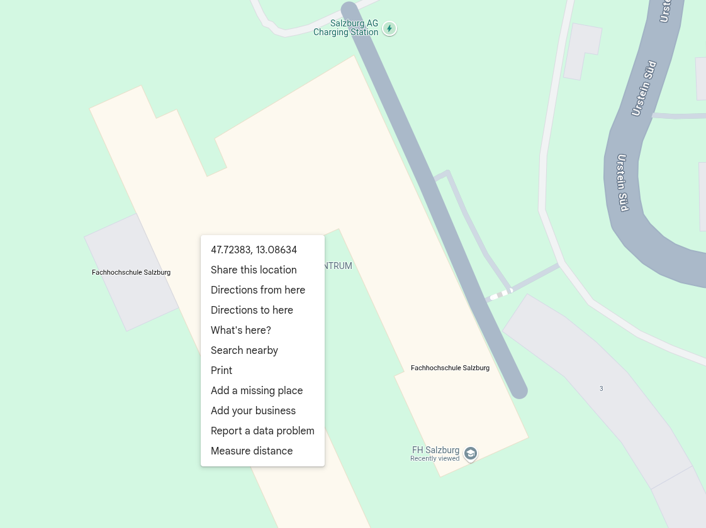

# Weather-Data-Producer
A simple python logic which fetches weather-data from the open Weather-API [https://open-meteo.com/](https://open-meteo.com/).

The docker container can be configured via environment variables:

- **WEATHER_LOCATION_LAT**  - Latitude of the location
- **WEATHER_LOCATION_LONG**  - Longitude of the location
- **WEATHER_FORECAST_DAYS**  - days to forecast
- **KAFKA_BROKER**  - the hostname:port of the Kafka broker
- **KAFKA_TOPIC**  - the topic-name where to publish



## Building the image
Simple execute docker build

```
docker build -t weather_data_producer .
```

## Running the container
Execute the container and provide parameters via environment variables.

> [!NOTE]  
> **Docker Network**: The correct docker network needs to be specified to be able to access kafka:9092

```bash
docker run \
    -e WEATHER_LOCATION_LAT=47.72 \
    -e WEATHER_LOCATION_LONG=13.09 \
    -e WEATHER_FORECAST_DAYS=4 \
    -e KAFKA_BROKER=kafka:9092 \
    -e KAFKA_TOPIC=weather-data-pipeline \
    # reusing existing network
    --network lab-network \
    weather_data_producer
```

## Local python development
If you want to interact with the python logic locally a python interpreter is needed. The logic relies on python 3.12. It uses the awesome [uv package manager](https://docs.astral.sh/uv/).

- You can even use `uv` to install python: [https://docs.astral.sh/uv/guides/install-python/](https://docs.astral.sh/uv/guides/install-python/).
- Create a local `python venv`: [https://docs.astral.sh/uv/pip/environments/](https://docs.astral.sh/uv/pip/environments/)
- Manage `dependencies`: [https://docs.astral.sh/uv/concepts/projects/dependencies/](https://docs.astral.sh/uv/concepts/projects/dependencies/)
- Sync `python packages`: [https://docs.astral.sh/uv/concepts/projects/sync/#syncing-the-environment](https://docs.astral.sh/uv/concepts/projects/sync/#syncing-the-environment)