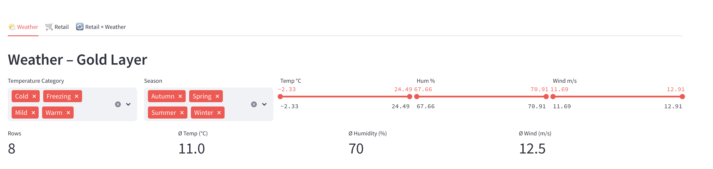
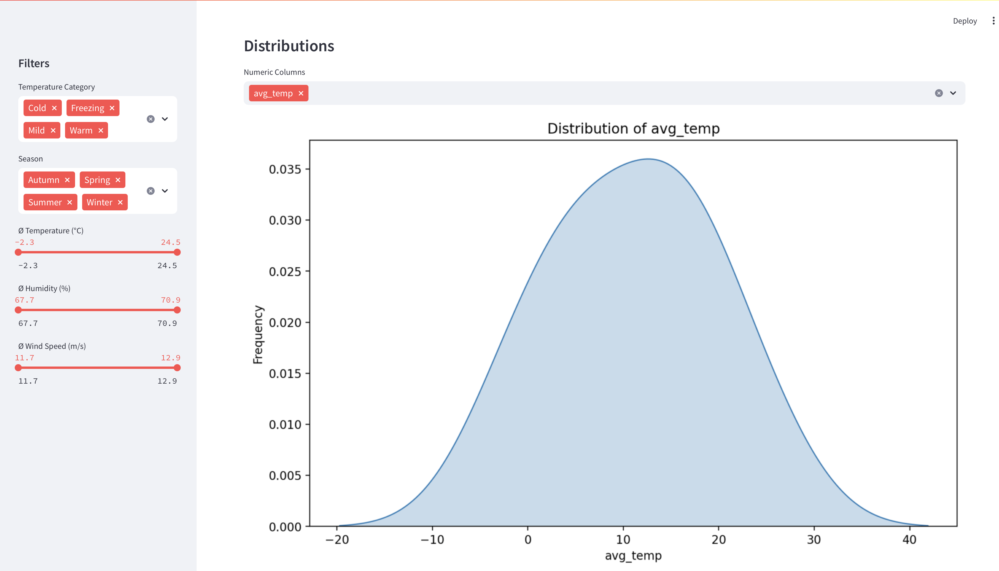
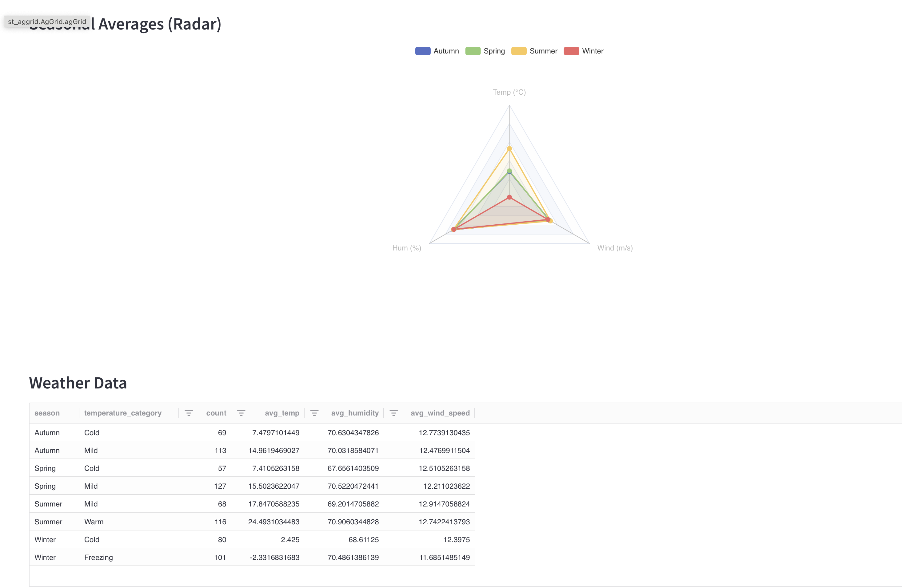
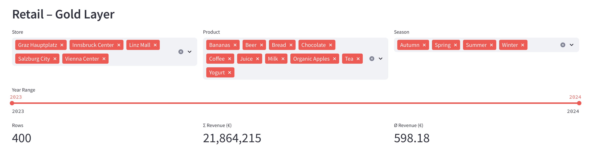
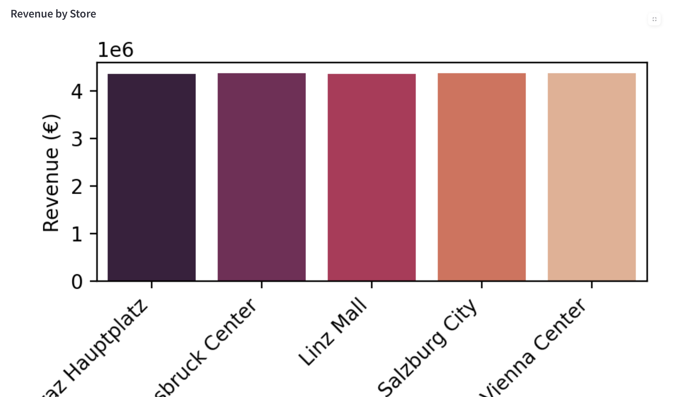
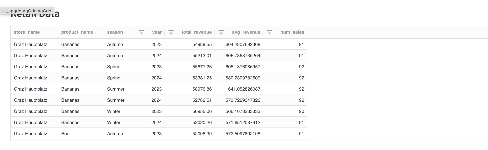
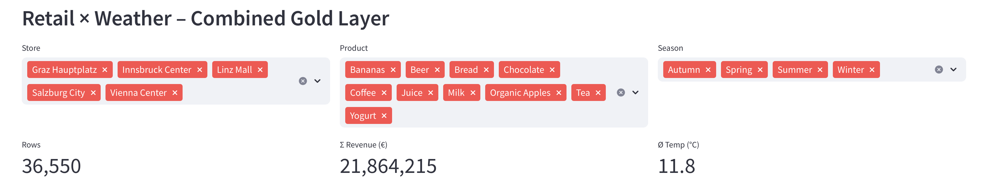
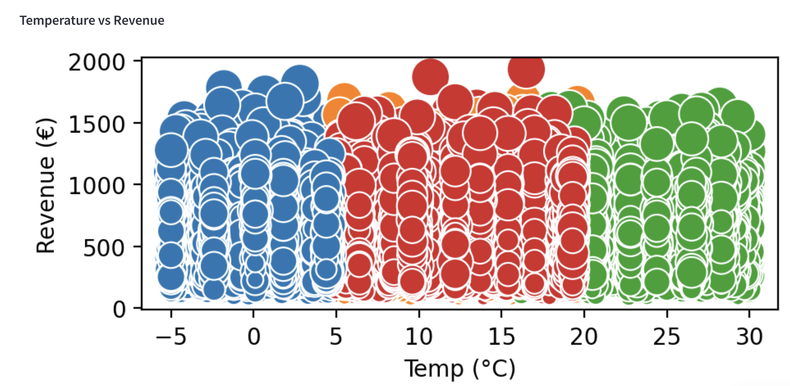
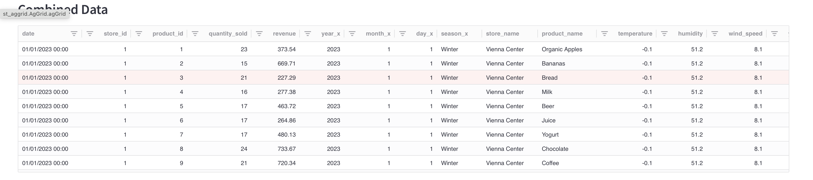

# 🌟 Gold Layer Weather Dashboard

A lightweight Streamlit application that visualises the aggregated *Gold‑Layer* weather data stored in MinIO.

---

## 📋 Prerequisites

| Step | Why it matters |
|------|----------------|
| **1. Execute all three batch notebooks**<br>`3_pipeline/notebooks/medallion_batch/1_batch_ingest_bronze.ipynb` → `2_batch_process_silver.ipynb` → `3_batch_serving_gold.ipynb` | The notebooks fill MinIO with the final *Gold* layer data. After they finish, the dashboard can read every Parquet file directly—no extra ETL step required. |
| **2. MinIO running & seeded** | The notebooks create the bucket **`batch-bucket`** and three Gold-layer objects:<br>• `gold/weather/weather_aggregated.parquet`<br>• `gold/retail/retail_aggregated.parquet`<br>• `gold/retail_weather/retail_weather_combined.parquet` |

> **Tip:** Use the provided `docker-compose`; everything’s already mounted.  
> Run the services in order as above (in point 1) described, then `docker compose up --build` to start **MinIO** and the **4_user_interface** dashboard.


## 🐳Running with Docker Compose

The repository already ships a `compose.yaml` that starts MinIO and the Streamlit app. **Important:** make sure `3_pipeline` has populated the `weather-data` bucket first!

```bash
# Build & start all services
$ docker compose up --build streamlit
```

Once everything is green, visit `http://localhost:8501`.

---

## 🗺️Environment Variables

| Variable          | Default                      | Description                           |
|-------------------| ---------------------------- | ------------------------------------- |
| `MINIO_ENDPOINT`  | `http://localhost:9000`      | URL where MinIO is reachable          |
| `MINIO_ACCESS_KEY` | `admin`                      | MinIO access key                      |
| `MINIO_SECRET_KEY` | `password`                   | MinIO secret key                      |
| `BUCKET_NAME`     | `batch-bucket`               | Bucket that contains the Parquet file |
| `WEATHER_KEY`     | `gold/weather/weather_aggregated.parquet` | Path to the aggregated Parquet file   |
| `RETAIL_KEY`     | `gold/retail/retail_aggregated.parquet` | Path to the aggregated Parquet file   |
| `COMBO_KEY`     | `gold/retail_weather/retail_weather_combined.parquet` | Path to the aggregated Parquet file   |

If you use Docker compose these are already provided via `.env`.  Override them in your shell if you need something different.

---

## 🖼️ Running app




















---

## 💬Need help?

* `make logs‑streamlit` (or `docker compose logs streamlit`) – watch for missing environment variables.
* Verify that the Parquet file exists in MinIO – open [http://localhost:9001](http://localhost:9001) and browse to `weather-data/gold/`.
