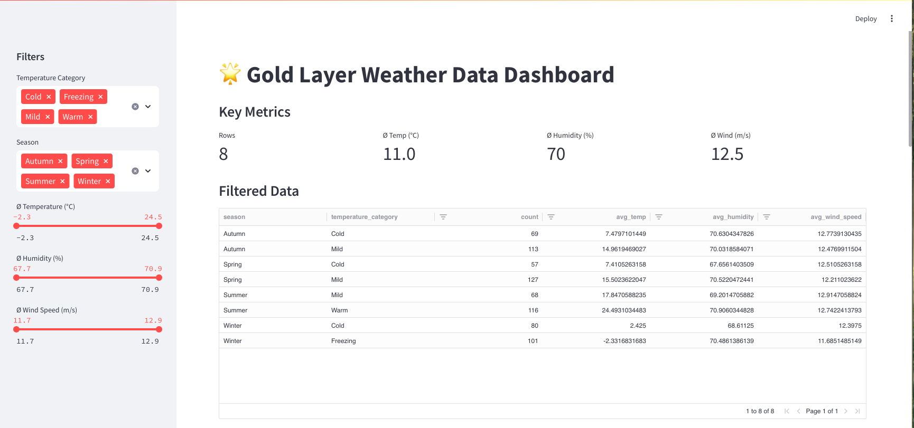
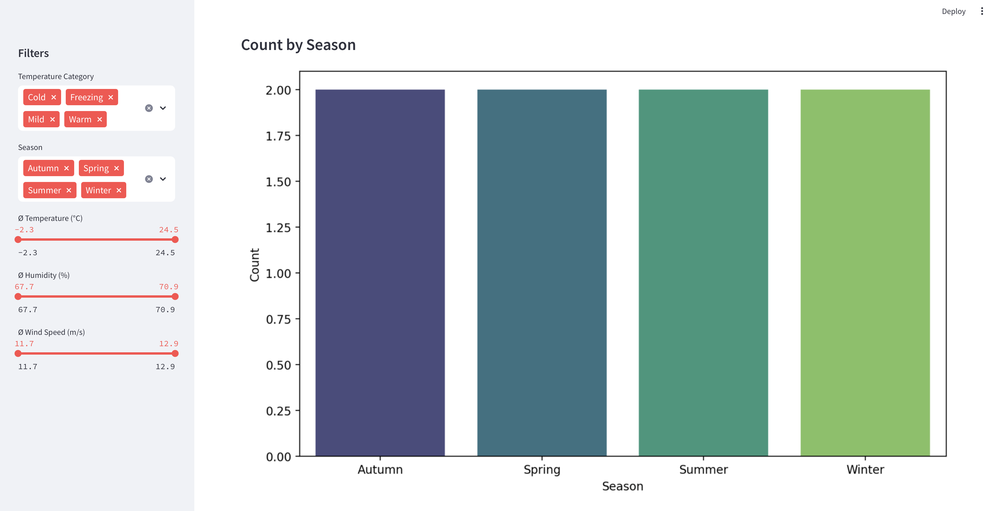

# 🌟 Gold Layer Weather Dashboard

A simple Streamlit application that visualises the aggregated *Gold‑Layer* weather data stored in MinIO.

---

## 📋 Prerequisites

| Step                          | Why it matters                                                                                                               |
| ----------------------------- | ---------------------------------------------------------------------------------------------------------------------------- |
| **1. Run `3_pipeline` first** | The ETL pipeline writes the *gold* Parquet file that this dashboard immediately reads from the shared volume / MinIO bucket. |
| **3. MinIO running & seeded** | Needs the bucket **`weather-data`** and object **`gold/weather_aggregated.parquet`**.                                        |

> **Tip :** If you used the project’s `docker-compose` everything is already mounted – you only have to spin up the services in the right order (`3_pipeline` → `streamlit`).


## 🐳Running with Docker Compose

The repository already ships a `docker-compose.yml` that starts MinIO and the Streamlit app. **Important:** make sure `3_pipeline` has populated the `weather-data` bucket first!

```bash
# Build & start all services
$ docker compose up --build streamlit
```

Once everything is green, visit `http://localhost:8501`.

---

## 🗺️Environment Variables

| Variable           | Default                           | Description                           |
| ------------------ | --------------------------------- | ------------------------------------- |
| `MINIO_ENDPOINT`   | `http://localhost:9000`           | URL where MinIO is reachable          |
| `MINIO_ACCESS_KEY` | `admin`                           | MinIO access key                      |
| `MINIO_SECRET_KEY` | `password`                        | MinIO secret key                      |
| `BUCKET_NAME`      | `weather-data`                    | Bucket that contains the Parquet file |
| `GOLD_FILE_NAME`   | `gold/weather_aggregated.parquet` | Path to the aggregated Parquet file   |

If you use Docker compose these are already provided via `.env`.  Override them in your shell if you need something different.

---

## 🖼️ Running app






---

## 💬Need help?

* `make logs‑streamlit` (or `docker compose logs streamlit`) – watch for missing environment variables.
* Verify that the Parquet file exists in MinIO – open [http://localhost:9001](http://localhost:9001) and browse to `weather-data/gold/`.
